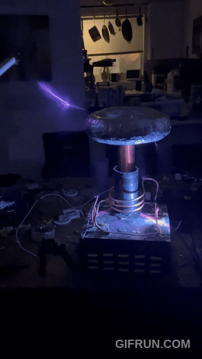
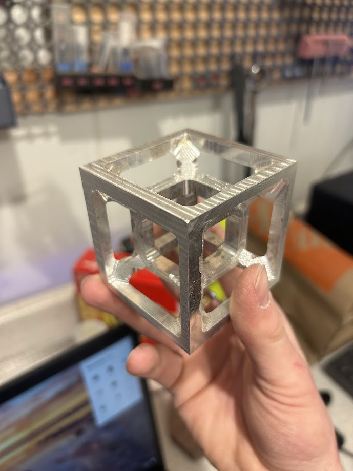
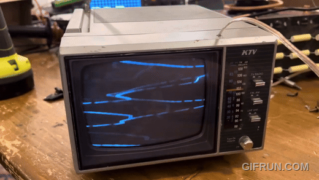
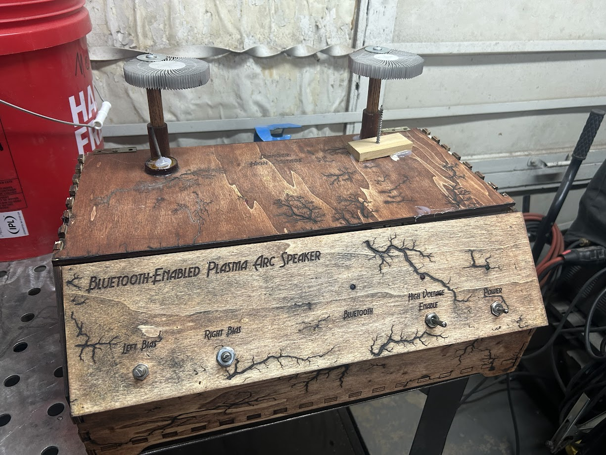
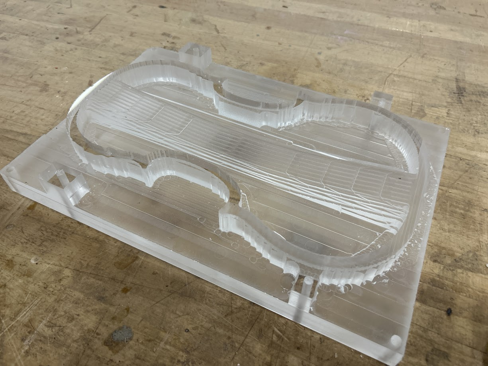
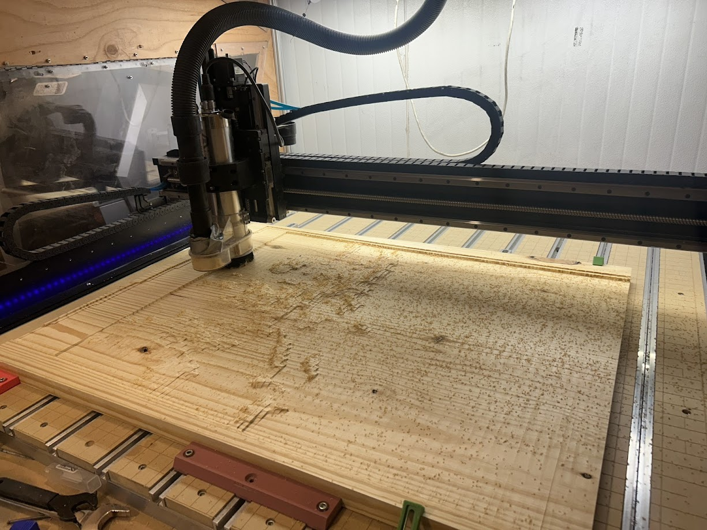

## Spark Gap Tesla Coil (gif opens to youtube)

## "4d" Hypercube - Milled from solid aluminum on a Shapeoko CNC

## Old TV turned into audio visualizer (gif opens to youtube)

## High Voltage Plasma Speaker - no "speakers", sound comes from the electrical arc! - picture links to video

)

### WIP - Electric violin milled from solid acrylic

### WIP - 4'x3' topographical map of colorado

